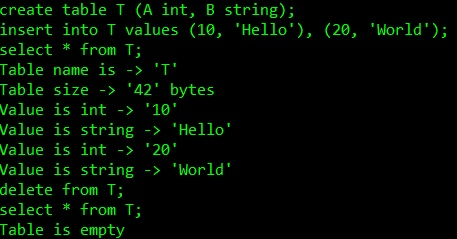

# DATA BASE
commands currently available: 
create table <tableName> (<varName, varType>) 
insert into <tableName> values (<values>) 
select * from tableName; 

EX: 

create table T (A int, B string); 
insert into T values (100, 'Hello World!'); 
select * from T; 

